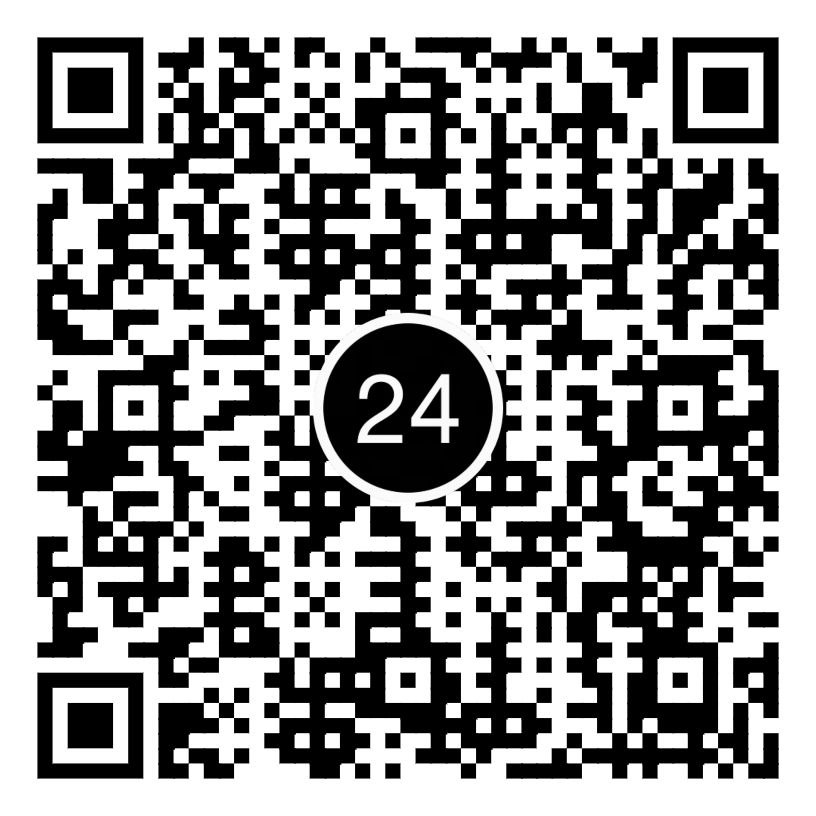
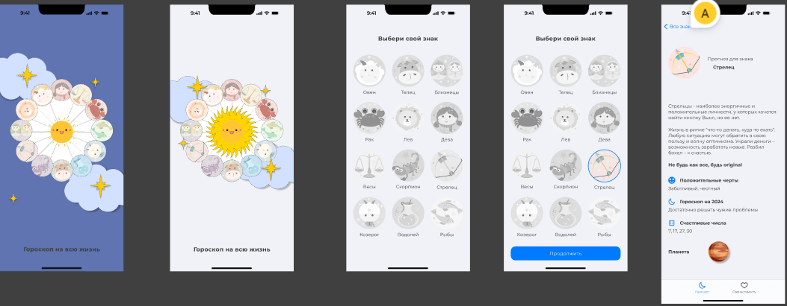

# Horoscop

Описание:  
Это проект, в котором я создал веб-страницу с уникальной версткой и дизайном, используя современные веб-технологии. Он включает в себя адаптивный интерфейс, а также пользовательский опыт, ориентированный на удобство и визуальную привлекательность.
Технологии:

- HTML, CSS, JavaScript(ванильный), Figma UX/UI c Prototype.
- Ссылка на макет фигма https://www.figma.com/design/nfG9o5ZWCJzuCrzRyK3a82/%D0%93%D0%BE%D1%80%D0%BE%D1%81%D0%BA%D0%BE%D0%BF?node-id=190213-1307&m=dev&t=uY1BdW0fmzJmcbCl-1
- Дизайн разработан для Iphone 11Plus – 428px.
- Адаптивный дизайн для разных устройств (мобильные, планшеты (768px), десктоп(1200px)).
- Чистая и семантическая верстка, соответствующая стандартам веб-разработки.
- Интерактивные элементы, такие как анимация.
- Современные подходы к оптимизации скорости загрузки и производительности.
  Цели проекта:  
  Этот проект был создан с целью улучшения навыков в верстке, освоения принципов адаптивного дизайна и улучшения пользовательского интерфейса.

## ❤️ If my projects are helpful, you can support me

Your support helps me continue developing and improving open-source projects.  
Any amount is greatly appreciated 🙏

---

### 📱 Scan to support via Privat24

Thank you for using and supporting my projects! 🚀

---

### Design layout

